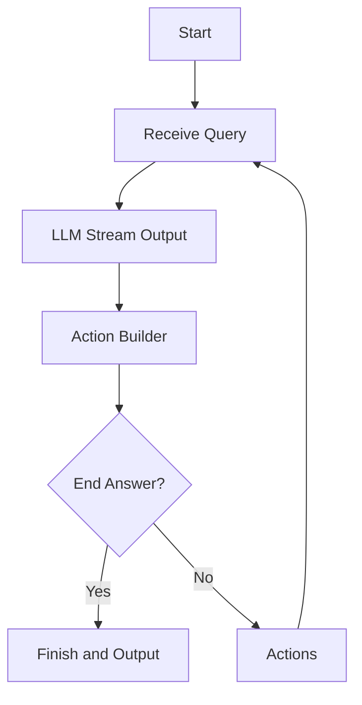

# NanoAgent

[中文](README_CN.md)

NanoAgent is a Python-based framework for building logical assistant agents capable of solving user requests through step-by-step planning and execution. It integrates with the OpenAI API for natural language processing and provides structured action-based workflows to deliver intelligent responses.


---

## Features

- **Step-by-Step Reasoning:** Processes user queries with systematic planning and action execution.
- **Custom Actions:** Define additional custom actions tailored to your use case.

---

## Installation

To install the package, clone the repository and install the dependencies:

```bash
pip install git+https://github.com/etrobot/nanoagent.git
```
or
```bash
poetry add git+https://github.com/etrobot/nanoagent.git
```

---

## Usage

### Initialization

Initialize the NanoAgent with your OpenAI API key and desired configurations:

```python
from nanoagent import NanoAgent

agent = NanoAgent(
    api_key="your_openai_api_key",
    base_url="your_base_url", 
    model="your_model", 
    max_tokens=your_max_tokens, 
    actions=["custom_action"], 
    debug=True
)
```

- `api_key`: Your OpenAI API key.
- `base_url`: OpenAI API endpoint.
- `model`: The OpenAI model to use (e.g., `gpt-4`).
- `max_tokens`: Maximum token limit for the LLM's responses.
- `actions`: List of custom actions (default includes `think_more` and `end_answer`).
- `debug`: Enables logging for debugging.

---

### Running the Agent

Use the `run()` method to process user queries. The agent will plan, execute, and respond based on the input.

```python
agent.run("What is the capital of France?")
```

### Custom Actions

Extend the functionality by defining custom actions. For example:

```python
def custom_action(input):
    return f"Custom action executed with input: {input}"
```

Add the custom action to the `actions` list during initialization.

---

### Debugging and Logs

Set `debug=True` during initialization to enable detailed logs of interactions and action executions.

```python
agent = NanoAgent(api_key="your_key", base_url="url", model="gpt-4o-mini", max_tokens=1024, debug=True)
```

Logs will include user queries, assistant responses, chosen actions, and their reasons.

---

## Example Workflow

1. **User Query:** The user provides a query, e.g., *"Explain how photosynthesis works."*
2. **Agent Response:** The assistant generates a detailed response, ending with an action from the defined list.
3. **Action Execution:** The chosen action is executed, and the result is integrated into the workflow.
4. **Final Output:** The agent outputs the final answer or continues the workflow if needed.

---

## License

This project is licensed under the MIT License. See the [LICENSE](LICENSE) file for details.


