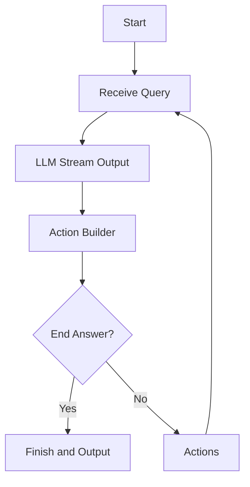

# NanoAgent

[中文](README_CN.md)

NanoAgent is a Python-based framework for building ReAct agents capable of solving user requests through self-reflection and tool calling.


---

## Features

- **ReAct:** Processes user queries with systematic planning and action execution.
- **Custom Actions:** Define additional custom actions tailored to your use case.
- **Memory:** Save the conversation to a JSON file.
- **Language Detection:** Automatically detect the language of the user's query.
- **No function calling:** Support models without function calling.

---

## Installation

To install the package, clone the repository and install the dependencies:

```bash
pip install git+https://github.com/etrobot/nanoagent.git
```
or
```bash
poetry add git+https://github.com/etrobot/nanoagent.git
```

---

## Usage

### Initialization

Initialize the NanoAgent with your OpenAI API key and desired configurations:

```python
from nanoagent import NanoAgent

agent = NanoAgent(
    api_key="your_openai_api_key",
    base_url="your_base_url", 
    model="your_model", 
    max_tokens=your_max_tokens, 
    actions=["custom_action"], 
    debug=True
)
```

- `api_key`: Your OpenAI API key.
- `base_url`: OpenAI API endpoint.
- `model`: The OpenAI model to use (e.g., `gpt-4`).
- `max_tokens`: Maximum token limit for the LLM's responses.
- `actions`: List of custom actions (default includes `think_more` and `end_answer`).
- `debug`: Enables logging for debugging.

---

### Running the Agent

Use the `run()` method to process user queries. The agent will plan, execute, and respond based on the input.

```python
for chunk in agent.run("which is bigger: 3.11 or 3.8?"):
    print(chunk, end='', flush=True)
```

### Custom Actions

Extend the functionality by defining custom actions. For example:

```python
def custom_action(input):
    return f"Custom action executed with input: {input}"
```

Add the custom action to the `actions` list during initialization.

---

## License

This project is licensed under the MIT License. See the [LICENSE](LICENSE) file for details.


