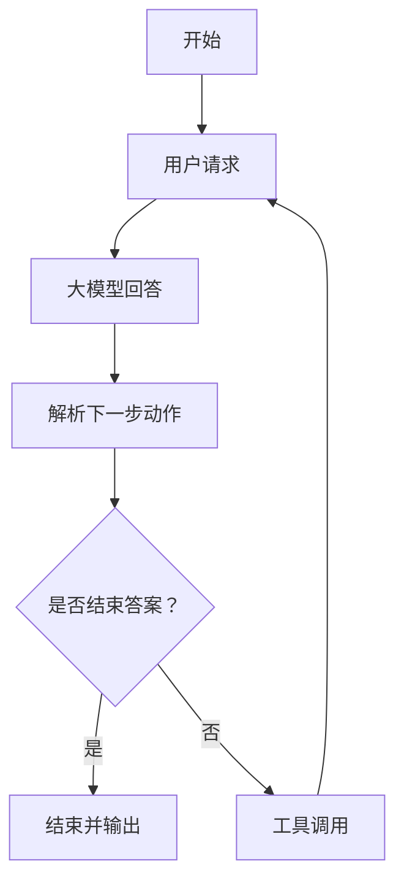

### NanoAgent

NanoAgent 是一个基于 Python 的框架，用于构建 ReAct 代理，能够通过反思和工具调用来解决用户请求。


---

## 功能特点

- **逐步推理：** 系统化地处理用户查询，采用规划和行动执行的方法。
- **自定义动作：** 可根据具体使用场景定义额外的自定义动作。
- **记忆：** 将对话保存到JSON文件中。
- **语言检测：** 自动检测用户查询的语言。
- **无函数调用：** 无需模型支持函数调用。

---

## 安装

通过以下方式克隆代码库并安装依赖：

```bash
pip install git+https://github.com/etrobot/nanoagent.git
```
或使用 Poetry：
```bash
poetry add git+https://github.com/etrobot/nanoagent.git
```

---

## 使用方法

### 初始化

使用您的 OpenAI API 密钥和所需配置来初始化 NanoAgent：

```python
from nanoagent import NanoAgent

agent = NanoAgent(
    api_key="your_openai_api_key",
    base_url="your_base_url", 
    model="your_model", 
    max_tokens=your_max_tokens, 
    actions=["custom_action"], 
    debug=True
)
```

参数说明：
- `api_key`：您的 OpenAI API 密钥。
- `base_url`：OpenAI API 的端点。
- `model`：所使用的 OpenAI 模型（例如 `gpt-4`）。
- `max_tokens`：模型生成响应的最大 Token 数。
- `actions`：自定义动作的列表（默认包含 `think_more` 和 `end_answer`）。
- `debug`：启用日志记录，便于调试。

---

### 运行Agent

使用 `run()` 方法处理用户查询或读取消息历史json文件，Agent会进行规划、执行和响应。

```python
for chunk in agent.run("3.11和3.8哪个大？"):
    print(chunk, end='', flush=True)
```
或
```python
for chunk in agent.run("history.json"):
    print(chunk, end='', flush=True)
```

---

### 自定义工具

通过定义自定义工具扩展功能。例如：

```python
def custom_action(input):
    return f"执行了自定义工具，输入内容是：{input}"
```

在初始化时，将自定义工具添加到 `actions` 列表中。

---

## 许可证

本项目基于 MIT 许可证开源发布。详情请参阅 [LICENSE](LICENSE) 文件。